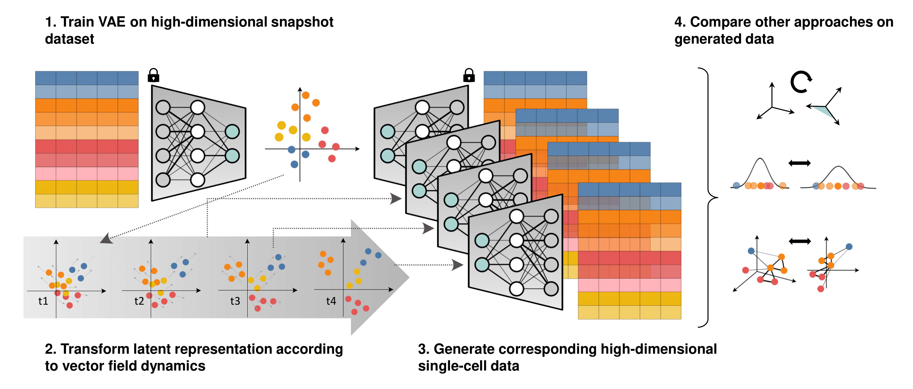

# scManifoldDynamics

## Overview
This repository contains the code to reproduce the Figures of our manuscript "Evaluating discrepancies in dimension reduction for structure in time-series single-cell RNA-sequencing data".

## Repository Structure

- **`Tutorial_notebooks`**  
  - **`main_workflow.ipynb`**  
    Main notebook that follows the overall modeling procedure. It reproduces Figures 3 and 4 from the main manuscript, as well as the figures in the supplementary material. 
  - **`transformations_tutorial.ipynb`**  
    Provides a more detailed walkthrough of Step 2 (temporal transformations) from the manuscript’s procedure.

- **`src`**  
  - Contains the Julia source code, organized into a module called `scManifoldDynamics`. This module includes all the functions needed for running the notebooks.

- **`Data`**  
  - Contains the preprocessed datasets used in this project inside the subfolder `Datasets`. It can be used as a folder to save the results when running the notebooks.
      
- **`Scripts`**  
  - Contains the additional scripts to preprocess the original datasets and reproduce Figure 1 of the main manuscript. 

## Setup and Dependencies
All code is written in Julia version 1.6.7. To replicate the environment:
1. Install Julia version 1.6.7.
2. Clone this repository.
3. From the project root, launch Julia and activate the environment (e.g., `] activate .`).
4. Run `] instantiate` to install all necessary packages specified in the TOML files.

(*) These steps are also done in the notebooks, so it is also possible to do them directly there.

## Used Datasets
### 1. PBMC 8k
Downloaded from [this Dropbox link](https://www.dropbox.com/scl/fo/3z3ac0dge3369sajd8ruz/h?dl=0&rlkey=0x0r05yxumwu8ksh0ml1t8ip5). Use the **`preprocess_PBMC_dataset.R`** script in this repository to preprocess the data (the already preprocessed version is provided in `Data/Datasets/`). 

### 2. Zeisel Brain Data
Available in R via the `scRNAseq` package (function `ZeiselBrainData()`), or under the GEO accession [GSE60361](https://www.ncbi.nlm.nih.gov/geo/query/acc.cgi?acc=GSE60361) The preprocessing steps are the ones described in the workflow given by [OSCA.workflows tutorial](http://bioconductor.org/books/3.14/OSCA.workflows/zeisel-mouse-brain-strt-seq.html). A preprocessed version is also included in `Data/Datasets/`.

### 3. Embryoid Body Data
Available at [Mendeley Data](https://data.mendeley.com/datasets/v6n743h5ng/1) and preprocessed according to the authors' indications described in their [Google Colab tutorial notebook](https://colab.research.google.com/github/KrishnaswamyLab/PHATE/blob/master/Python/tutorial/EmbryoidBody.ipynb#scrollTo=ZAdnUiMDFdEf).

